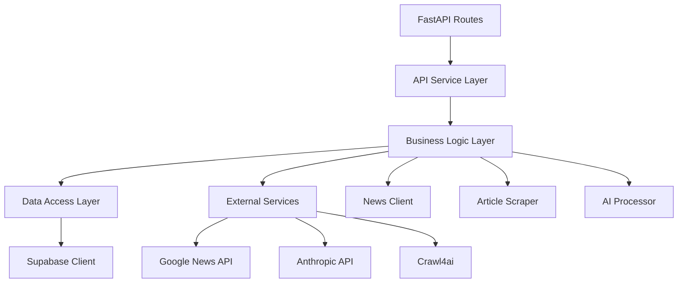
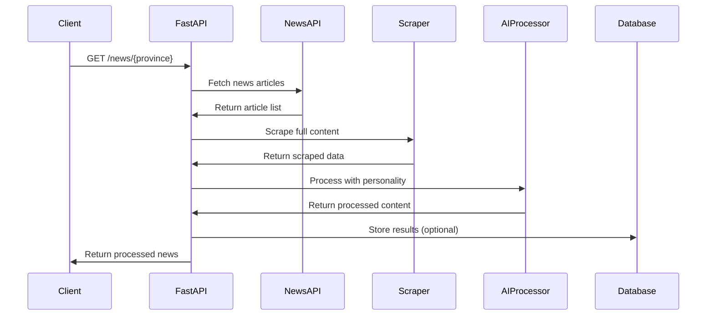

# TKR News Gather - Architecture Overview Analysis Report

**Analysis Date:** 2025-01-06T00:00:00Z  
**Repository:** tkr-news-gather  
**Analyst:** Overview Analysis Agent  

## Executive Summary

TKR News Gather is a well-structured Python application designed for collecting, processing, and storing Canadian provincial news. The project demonstrates modern software architecture principles with clear separation of concerns, microservices-ready design, and cloud deployment capabilities.

### Key Strengths
- **Clear Architecture**: Well-organized modular structure with distinct layers
- **Cloud-Native Design**: Docker containerization and serverless deployment support
- **Extensible AI Integration**: Multiple personality hosts for news processing
- **Database Flexibility**: Optional Supabase integration for persistence
- **Security Awareness**: Dedicated security configurations and middleware

### Areas for Improvement
- Limited test coverage visible in repository
- No apparent CI/CD pipeline configuration
- Missing API versioning strategy
- Lack of comprehensive error recovery mechanisms

## 1. Project Structure Analysis

### Directory Organization
```
tkr-news-gather/
├── src/                    # Application source code
│   ├── news/              # News domain logic
│   ├── utils/             # Shared utilities
│   ├── api.py             # Core API logic
│   └── main.py            # FastAPI application
├── database/              # Database schemas
├── _project/              # Project documentation
├── tests/                 # Test suite
├── scripts/               # Utility scripts
└── requirements*.txt      # Dependency management
```

### Module Boundaries
The project follows a clean modular architecture:
- **News Module**: Core business logic for news gathering and processing
- **Utils Module**: Cross-cutting concerns (logging, config, clients)
- **API Layer**: REST endpoint definitions and request handling
- **Database Layer**: PostgreSQL schema with Supabase integration

## 2. Architecture Patterns

### Design Pattern: Layered Architecture


### Key Architectural Decisions
1. **Async-First Design**: Leveraging Python's asyncio for concurrent operations
2. **Service-Oriented**: Each component (news client, scraper, processor) is independent
3. **Optional Persistence**: Database integration is optional, allowing flexible deployment
4. **Multiple Entry Points**: Support for API server, local execution, and serverless

### Identified Patterns
- **Repository Pattern**: SupabaseClient acts as data repository
- **Factory Pattern**: NewsProcessor creates different host personalities
- **Strategy Pattern**: Multiple news processing strategies (anchor, friend, newsreel)
- **Adapter Pattern**: GoogleNewsClient adapts external API to internal model

## 3. Technology Stack

### Core Technologies
- **Language**: Python 3.9
- **Web Framework**: FastAPI (modern, async, auto-documented)
- **ASGI Server**: Uvicorn with standard extras
- **Database**: PostgreSQL via Supabase (optional)
- **AI/LLM**: Anthropic Claude API
- **Web Scraping**: Crawl4ai, BeautifulSoup4, lxml

### Development Dependencies
- **Testing**: pytest (visible in pytest.ini)
- **Security**: python-jose, passlib, slowapi
- **Configuration**: python-dotenv
- **Logging**: Built-in Python logging with custom wrapper

### Infrastructure
- **Containerization**: Docker with multi-stage builds
- **Orchestration**: Docker Compose for local development
- **Serverless**: RunPod handler for cloud deployment
- **CI/CD**: Not configured (potential improvement area)

## 4. Data Flow Architecture

### Request Flow


### State Management
- **Stateless API**: No server-side session management
- **Database State**: News sessions and articles stored in PostgreSQL
- **Configuration State**: Environment variables for runtime config

### API Endpoints Structure
```
/health                          # Health checks
/provinces                       # Province listing
/news/{province}                # News retrieval
/process/{province}/{host_type}  # AI processing
/pipeline/{province}            # Full pipeline execution
/sessions/{province}/latest     # Database queries
```

## 5. Scalability Analysis

### Horizontal Scalability
- **Stateless Design**: API can be scaled horizontally
- **Async Operations**: Efficient resource utilization
- **Database Connection Pooling**: Via Supabase client
- **Rate Limiting**: Implemented via slowapi

### Vertical Scalability
- **Concurrent Scraping**: Configurable MAX_CONCURRENT_SCRAPES
- **Batch Processing**: Multiple articles processed together
- **Background Tasks**: Pipeline operations run asynchronously

### Potential Bottlenecks
1. **External API Limits**: Google News and Anthropic rate limits
2. **Web Scraping**: Sequential scraping could be optimized
3. **Database Writes**: No apparent write batching strategy
4. **Memory Usage**: Full article content held in memory

## 6. Security Architecture

### Security Layers
1. **API Security**: 
   - CORS middleware configured
   - Optional JWT authentication (security module present)
   - Rate limiting protection
   
2. **Data Security**:
   - Environment variable configuration
   - Row-level security in database schema
   - Service role access patterns

3. **Container Security**:
   - Non-root user in Docker
   - Security-focused package versions
   - Regular security updates mentioned

### Security Considerations
- API keys stored in environment variables
- Database credentials properly isolated
- Health check endpoints don't expose sensitive data
- Security scanning scripts available

## 7. Code Organization Quality

### Strengths
- **Clear Naming**: Descriptive file and function names
- **Single Responsibility**: Each module has clear purpose
- **DRY Principle**: Shared utilities prevent duplication
- **Configuration Management**: Centralized in Config class

### Areas for Enhancement
- **Documentation**: Limited inline documentation visible
- **Type Hints**: Partial type annotation coverage
- **Error Handling**: Basic try-catch, could be more granular
- **Testing Structure**: Test directory exists but coverage unclear

## 8. Deployment Architecture

### Deployment Options
1. **Local Development**: run_local.py for quick testing
2. **Docker Container**: Full containerization support
3. **Docker Compose**: Multi-container orchestration
4. **Serverless**: RunPod handler for cloud functions

### Environment Configuration
- Development, staging, production environments supported
- Environment-specific configurations via .env files
- Configurable logging levels and API limits

## 9. Feature-to-Code Mapping

| Feature | Code Location | Components |
|---------|--------------|------------|
| News Collection | `src/news/google_news_client.py` | GoogleNewsClient |
| Web Scraping | `src/news/article_scraper.py` | ArticleScraper, Crawl4ai |
| AI Processing | `src/news/news_processor.py` | NewsProcessor, personalities |
| API Endpoints | `src/main.py`, `src/api.py` | FastAPI routes |
| Database Operations | `src/utils/supabase_client.py` | SupabaseClient |
| Province Management | `src/news/provinces.py` | Province definitions |
| Security | `src/utils/security.py`, `src/utils/middleware.py` | Auth, rate limiting |
| Configuration | `src/utils/config.py` | Config class |

## 10. Architectural Recommendations

### Immediate Improvements
1. **API Versioning**: Implement /v1/ prefix for future compatibility
2. **Error Handling**: Create centralized error handling middleware
3. **Caching Layer**: Add Redis for frequently accessed data
4. **Test Coverage**: Expand unit and integration tests

### Long-term Enhancements
1. **Event-Driven Architecture**: Consider message queues for pipeline operations
2. **Microservices Split**: Separate scraping, processing, and storage services
3. **Monitoring**: Add APM and logging aggregation
4. **CI/CD Pipeline**: Implement automated testing and deployment
5. **API Gateway**: Consider adding for rate limiting and authentication

## Conclusion

TKR News Gather demonstrates solid architectural foundations with room for growth. The modular design, clear separation of concerns, and cloud-ready infrastructure provide a strong base for scaling. Priority should be given to enhancing test coverage, implementing comprehensive error handling, and adding monitoring capabilities for production readiness.

The architecture successfully balances simplicity with extensibility, making it suitable for both current requirements and future enhancements. The optional database integration and multiple deployment options showcase thoughtful design decisions that accommodate various use cases.